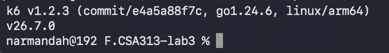
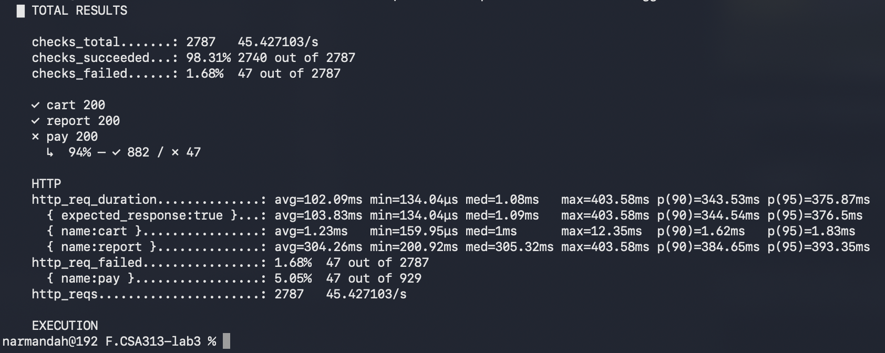
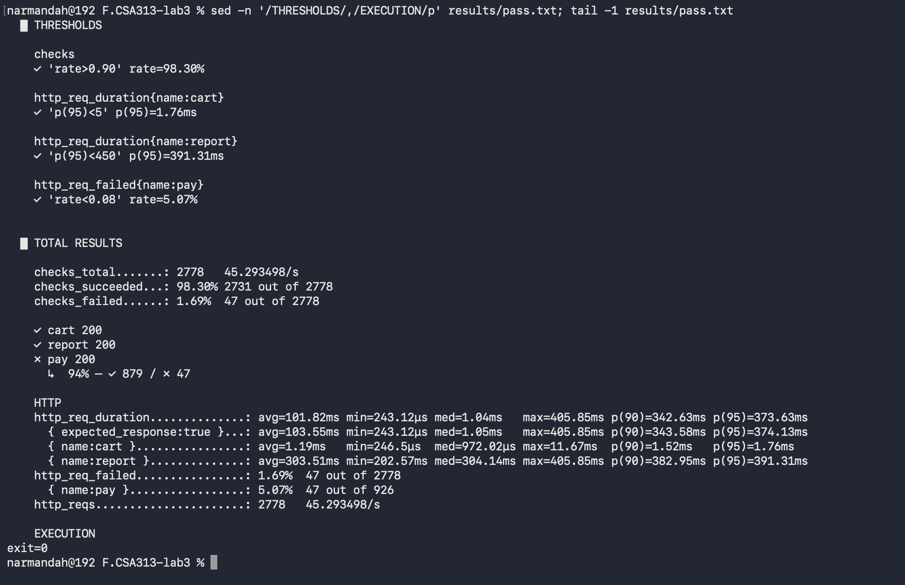
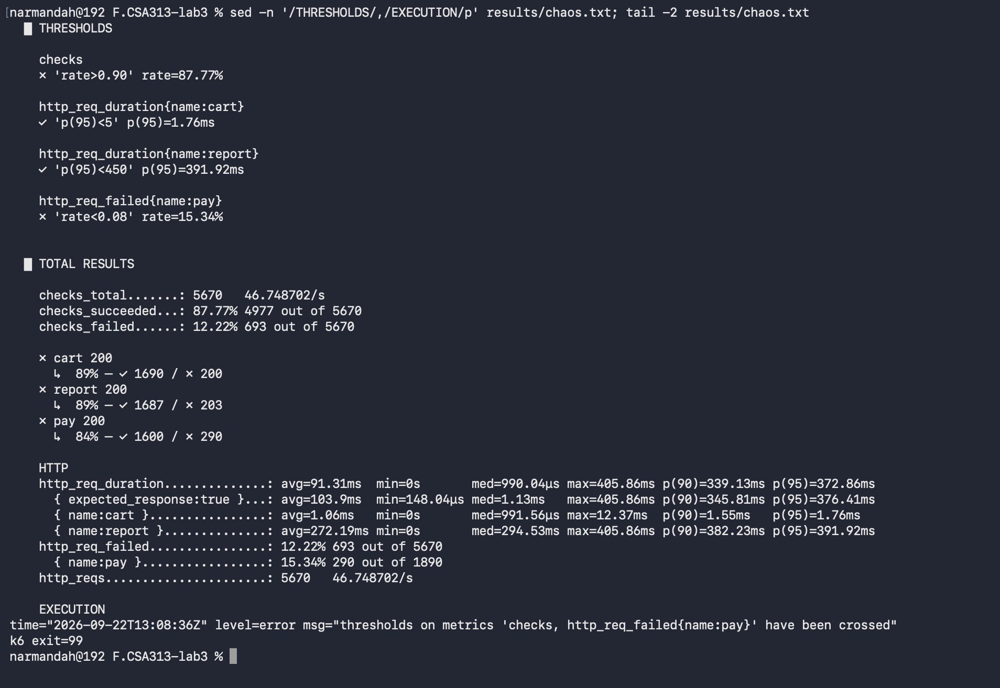
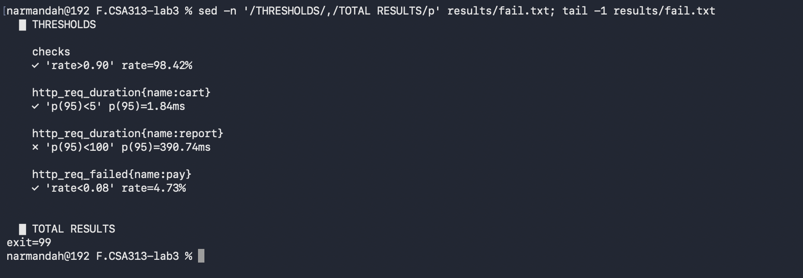

# Лаб 3: Чанарын сценарио → SLO → k6 threshold

F.CSA313 — Программ хангамжийн чанарын баталгаа ба тест (2026)

**Оюутан:** Г. Нармандах | **Код:** B232270057

## 1. Орчин

`k6 version` командын гаралт ([results/k6-version.txt](results/k6-version.txt)):

```
k6 v1.2.3 (commit/e4a5a88f7c, go1.24.6, linux/arm64)
```

| Зүйл | Утга |
|---|---|
| Машин | MacBook Air (Apple Silicon) дээрх Linux орчин, aarch64 |
| Node.js | Тест ажилласан Linux орчинд v22.23.2 (macOS дээр node v26.7.0), Express 5 |
| Бай (target) | Зөвхөн локал сервер [`server.js`](server.js) — `http://localhost:3000` |
| Load тест | Grafana k6 v1.2.3 (AGPL v3) |

**Ёс зүй:** бүх тестийг зөвхөн өөрийн машин дээр ажиллаж буй локал сервер рүү хийсэн. Гадны ямар ч сервер рүү хүсэлт илгээгээгүй.

> Тайлбар: эхний танилцах хэмжилтийг (`baseline.js` → [results/baseline.txt](results/baseline.txt)) macOS дээр шууд суулгасан k6 v2.2.0-оор хийсэн бол эцсийн бүх хэмжилтийг (baseline-tagged, pass, chaos, fail) дээрх Linux орчны k6 v1.2.3-аар нэг ижил нөхцөлд дахин ажиллуулсан. README дэх бүх тоо эдгээр сүүлийн файлуудаас авагдсан.

### Endpoint-ууд (server.js)

| Endpoint | Зан төлөв |
|---|---|
| `POST /cart/add` | Хурдан — шууд JSON буцаана |
| `GET /report` | Удаан — 200–400 мс санамсаргүй хүлээлт |
| `POST /pay` | Найдваргүй — хүсэлтийн ~5% нь HTTP 500 |

### Ажиллуулах

```bash
node server.js                       # 1-р терминал
k6 version | tee results/k6-version.txt                                   # 2-р терминал
k6 run baseline-tagged.js | tee results/baseline-tagged.txt               # Алхам 1: baseline
k6 run slo-test.js | tee results/pass.txt                                 # Алхам 4: PASS
k6 run --duration 2m slo-test.js | tee results/chaos.txt                  # Алхам 5: chaos (45с-д сервер зогсоож, 10с дараа асаана)
k6 run slo-test-fail.js | tee results/fail.txt; echo "exit=$?"            # Алхам 6: FAIL
```

## 2. Baseline хэмжилт (босго сонгох үндэслэл)

Босго тогтоохоос ӨМНӨ [`baseline-tagged.js`](baseline-tagged.js)-ээр 20 VU, 1 минутын хэмжилт хийж бодит утгуудыг олсон → [results/baseline-tagged.txt](results/baseline-tagged.txt):

| Хэмжүүр | Baseline утга |
|---|---|
| `http_req_duration{name:cart}` p95 | **1.83 мс** (p90 1.62 мс, max 12.35 мс) |
| `http_req_duration{name:report}` p95 | **393.35 мс** (min 200.92 мс, max 403.58 мс) |
| `http_req_failed{name:pay}` | **5.05%** (47 / 929) |
| `checks` амжилтын хувь | **98.31%** (2740 / 2787) |
| Нийт throughput | 2787 хүсэлт, **45.427103/s** |





Энэ алхам чухал: зааварт жишээ болгон өгсөн `p(95)<200` босго нь `/cart/add`-ын хувьд бодит утгаас (1.83 мс) 100 дахин сул тул юу ч хэмжихгүй.

## 3. Гурван чанарын сценарио (6 хэсэгтэй формат)

### 3.1 Performance сценарио — сагсанд нэмэх хурд

| Хэсэг | Агуулга |
|---|---|
| **Тойм** | Хэвийн ачааллын үед хэрэглэгч бараагаа сагсанд нэмэхэд систем шууд хариу өгөх ёстой. |
| **Системийн төлөв** | Хэвийн ажиллагаа, сервер асаалттай, өмнөх эвдрэлгүй. |
| **Орчны төлөв** | Локал Express сервер (localhost:3000), 20 зэрэгцээ хэрэглэгч (VU), ~45 хүсэлт/с нийт ачаалал, 1 минут. |
| **Гадаад өдөөлт** | Хэрэглэгч "Сагсанд нэмэх" товч дарж `POST /cart/add` хүсэлт илгээнэ. |
| **Шаардлагатай хариу** | Сервер HTTP 200 буцааж, сагсны шинэ агуулгыг хэрэглэгчид мэдрэгдэхээргүй хугацаанд харуулна. |
| **Хэмжүүр** | `/cart/add`-ын хариу хугацааны **p95 < 5 мс** (baseline 1.83 мс), error rate 0%. |

### 3.2 Reliability сценарио — төлбөрийн эвдрэлийн давтамж

| Хэсэг | Агуулга |
|---|---|
| **Тойм** | Төлбөрийн gateway тогтворгүй ажилладаг тул хэсэг хүсэлт амжилтгүй болдог; энэ давтамж хүлээн зөвшөөрөгдөх хэмжээнд байх ёстой. |
| **Системийн төлөв** | Сервер хэвийн асаалттай, гэхдээ `/pay` нь дотоод gateway алдаанаас болж хүсэлтийн ~5%-д HTTP 500 буцаадаг. |
| **Орчны төлөв** | Локал сервер, 20 VU, 1 минут, сүлжээний сааталгүй (localhost). |
| **Гадаад өдөөлт** | Хэвийн хэрэглэгч захиалгаа баталгаажуулж `POST /pay` хүсэлт илгээнэ. |
| **Шаардлагатай хариу** | Амжилтгүй хүсэлт нь алдааны кодоо тодорхой буцаах ба ийм хүсэлтийн эзлэх хувь тогтоосон хязгаараас хэтрэхгүй байх. |
| **Хэмжүүр** | `/pay`-ийн **error rate (POFOD) < 8%** нэг минутын цонхонд (baseline 5.05%). |

### 3.3 Availability сценарио — сервер унаж дахин асах

| Хэсэг | Агуулга |
|---|---|
| **Тойм** | Сервер гэнэт зогсоод дахин асахад хэрэглэгчийн хүсэлтүүдийн хэдэн хувь нь амжилттай үйлчлэгдэхийг хэмжинэ. |
| **Системийн төлөв** | Тест ажиллаж байх үед процесс зогссон (crash), 10 секундийн дараа гараар дахин асаасан. |
| **Орчны төлөв** | Локал сервер, 20 VU, **2 минутын** цонх, зогсолт 45 дахь секундэд эхэлсэн. |
| **Гадаад өдөөлт** | ЭВДРЭЛ — серверийн процесс Ctrl+C/kill-ээр зогсох (chaos туршилт). |
| **Шаардлагатай хариу** | Зогсолтын үед хүсэлтүүд тодорхой алдаагаар шууд буцах, сервер сэргэмэгц үйлчилгээ гараар оролцоогүйгээр хэвийн үргэлжлэх. |
| **Хэмжүүр** | 2 минутын цонхонд **амжилттай хүсэлтийн хувь (availability) > 90%**, сэргэх хугацаа ≤ 12 секунд. |

**Сайн сценариогийн 5 шинжээр өөрийгөө шалгасан:** итгэмжтэй (гурвуулаа бодит хэрэглээний үйлдэл — сагслах, төлөх, эвдрэл), үнэ цэнэтэй (алдвал шууд орлого/итгэлд нөлөөлнө), тодорхой (endpoint, ачаалал, цонх бүгд заагдсан), нарийн (хэмжүүр бүр тоогоор илэрхийлэгдсэн), ойлгомжтой (нэг хүснэгтээр уншигдана).

## 4. SLO хүснэгт ба error budget

| Сценарио | SLI (юуг хэмжих) | Босго | Цонх / нөхцөл | Босгыг сонгосон үндэслэл |
|---|---|---|---|---|
| Performance | `http_req_duration{name:cart}` p95 | **p(95) < 5 мс** | 20 VU, 1 мин | Baseline p95 = 1.83 мс тул ~2.7 дахин нөөцтэй; жишээний 200 мс бол бодит утгаас 100 дахин сул, ямар ч регрессийг барихгүй. |
| Reliability | `http_req_failed{name:pay}` rate | **rate < 0.08 (8%)** | 20 VU, 1 мин | Серверт 5% алдаа зориуд суулгасан, хэмжилтээр 5.05% гарсан; санамсаргүй хэлбэлзэлд зориулж ~3 нэгжийн нөөц үлдээв. |
| Availability | `checks` амжилтын хувь | **rate > 0.90 (90%)** | 20 VU, 2 мин, 10с зогсолт | Хэвийн үед 98.31% тул 90% нь 10 секундийн зогсолтыг багтаах зорилготой түвшин. |
| (4 дэх) Report latency | `http_req_duration{name:report}` p95 | **p(95) < 450 мс** | 20 VU, 1 мин | Сервер 200–400 мс хүлээдэг тул онолын дээд хязгаар нь 400 мс; 450 мс нь ~12% нөөц. |

Эдгээр дөрвөн тоо [`slo-test.js`](slo-test.js) доторх threshold-той ЯГ ижил.

### Error budget (availability SLO ≥ 90%, 2 минутын цонх)

| Тооцох арга | Тооцоо | Үр дүн |
|---|---|---|
| **Цагаар** | 120 с × 10% | **12 секунд** зогсох "эрх" |
| **Хүсэлтээр** | 5670 хүсэлт × 10% | **567 хүсэлт** амжилтгүй болж болно |

Chaos туршилтад бодит зогсолт ~10 секунд байсан тул **цагийн budget-д багтсан** (10 с < 12 с), гэвч амжилтгүй хүсэлт 693 болж **хүсэлтийн budget-ээс 126-аар хэтэрсэн**. Шалтгаан: сервер унасан үед хүсэлт 200–400 мс хүлээхгүй, `connection refused` болж агшин зуур буцдаг тул зогсолтын нэг секунд хэвийн секундээс хамаагүй олон хүсэлт "иддэг". Хэвийн үед секундэд ~45 хүсэлт боловсруулагддаг бол зогсолтын үед мөн хугацаанд түүнээс олон хүсэлт унаж бүртгэгддэг. Иймээс ЦАГААР тооцсон budget нь хүсэлтээр тооцсоноос илүү өршөөнгүй харагддаг.

## 5. Алхам 4 — PASS гаралт

[results/pass.txt](results/pass.txt) — `k6 run slo-test.js`, 20 VU, 1 мин:

```
█ THRESHOLDS
  checks
  ✓ 'rate>0.90' rate=98.30%
  http_req_duration{name:cart}
  ✓ 'p(95)<5' p(95)=1.76ms
  http_req_duration{name:report}
  ✓ 'p(95)<450' p(95)=391.31ms
  http_req_failed{name:pay}
  ✓ 'rate<0.08' rate=5.07%
exit=0
```

| Хэмжүүр | Утга | SLO | Үр дүн |
|---|---|---|---|
| cart p95 | 1.76 мс | < 5 мс | ✓ |
| report p95 | 391.31 мс | < 450 мс | ✓ |
| pay error rate | 5.07% (47 / 926) | < 8% | ✓ |
| checks | 98.30% (2731 / 2778) | > 90% | ✓ |
| Нийт хүсэлт | 2778 (45.293498/s) | | |



Дөрвүүлээ хангагдсан тул k6 **exit code 0** буцаасан — CI pipeline дээр build үргэлжилнэ.

## 6. Алхам 5 — Chaos туршилт

`k6 run --duration 2m slo-test.js` ажиллаж байх үед 45 дахь секундэд серверийн процессыг зогсоож, 10 секунд хүлээгээд дахин асаасан → [results/chaos.txt](results/chaos.txt)

```
█ THRESHOLDS
  checks
  ✗ 'rate>0.90' rate=87.77%
  http_req_duration{name:cart}
  ✓ 'p(95)<5' p(95)=1.76ms
  http_req_duration{name:report}
  ✓ 'p(95)<450' p(95)=391.92ms
  http_req_failed{name:pay}
  ✗ 'rate<0.08' rate=15.34%
k6 exit=99
```

| Хэмжүүр | Хэвийн (pass.txt) | Chaos (chaos.txt) |
|---|---|---|
| checks амжилтын хувь | 98.30% | **87.77%** (4977 / 5670) |
| Нийт амжилтгүй хүсэлт | 47 | **693** (12.22%) |
| `/pay` error rate | 5.07% | **15.34%** (290 / 1890) |
| cart p95 | 1.76 мс | 1.76 мс |
| report p95 | 391.31 мс | 391.92 мс |



**Бодит availability (ХҮСЭЛТЭЭР):** (5670 − 693) / 5670 ≈ **87.78%** (k6-ийн checks-ээр 87.77%) — SLO (90%) зөрчигдсөн, error budget 567 хүсэлт байхад 693 хүсэлт унасан.

**Юу ажиглагдав:**

* Зогсолтын үед latency-ийн хэмжүүрүүд (cart, report p95) бараг өөрчлөгдөөгүй — учир нь унасан хүсэлт хугацаа "зарцуулдаггүй" (min=0s). Өөрөөр хэлбэл зөвхөн latency хардаг SLO эвдрэлийг огт олж харахгүй.
* Нэг эвдрэл **хоёр SLO-г зэрэг** зөрчсөн: availability (checks 87.77%) ба reliability (`/pay` 15.34%). Учир нь сервер унасан үед `/pay`-ийн хүсэлт бүр мөн унадаг тул "gateway-ийн 5% алдаа" ба "сервер огт байхгүй" хоёр нэг метрикт нийлж орсон.
* **Тусгаарлах арга:** reliability SLI-г зөвхөн серверээс ирсэн 5xx хариунд тооцож, холболт үүсээгүй (connection refused) хүсэлтүүдийг availability SLI-д тусад нь ангилах хэрэгтэй — k6-д үүнийг `http_req_failed{name:pay,expected_response:true}` шиг нарийсгасан метрик эсвэл `status === 0` тохиолдлыг тусад нь тоолох `Rate` custom метрикээр хийж болно.

## 7. Алхам 6 — Зориуд FAIL болгосон threshold

[`slo-test-fail.js`](slo-test-fail.js) — зөвхөн `/report`-ын босгыг `p(95)<100` болгосон (сервер өөрөө 200 мс-ээс хурдан хэзээ ч хариулдаггүй тул ямар ч машин дээр найдвартай FAIL болно) → [results/fail.txt](results/fail.txt):

```
█ THRESHOLDS
  checks
  ✓ 'rate>0.90' rate=98.42%
  http_req_duration{name:cart}
  ✓ 'p(95)<5' p(95)=1.84ms
  http_req_duration{name:report}
  ✗ 'p(95)<100' p(95)=390.74ms
  http_req_failed{name:pay}
  ✓ 'rate<0.08' rate=4.73%
exit=99
```



`ERRO … thresholds on metrics 'http_req_duration{name:report}' have been crossed` мөр гарч, k6 **exit code 99** буцаасан. CI pipeline яг энэ кодоор build-ийг зогсооно.

Зааварт дурдсан асуултын хариу: `/cart/add`-ын босгыг `p(95)<50` болгоход localhost дээр PASS хэвээр үлдэнэ, учир нь бодит p95 нь 1.8 мс — 50 мс нь түүнээс 27 дахин сул. Threshold нь зөвхөн бодит хэмжилтэд ойр байж л утга учиртай болдог.

## 8. Дүгнэлт

1. Сценариогоос SLO руу шилжихэд хамгийн хэцүү нь үгээр бичсэн "хурдан хариулах ёстой" гэсэн шаардлагыг ЯМАР тоо гэдгийг шийдэх байсан — үүний хариуг зөн совингоор биш, baseline хэмжилтээс гаргаж авлаа.
2. Baseline хэмжилт хийснээр зааврын жишээ болох `p(95)<200` нь `/cart/add`-ын хувьд (бодит p95 = 1.83 мс) утгагүй сул босго болохыг харсан тул өөрийн босгоо 5 мс болгов.
3. SLO-г k6 threshold болгоход `{name:cart}` гэх tag-аар endpoint тус бүрийг салгаж хэмждэг болсон нь нэгдсэн дундажийн ард нуугдах асуудлыг илрүүлэх боломж өгсөн.
4. Хэвийн нөхцөлд дөрвөн threshold бүгд хангагдаж exit code 0 гарсан нь сценарио → SLO → threshold гэсэн шилжилт бүрэн ажиллаж байгааг баталсан.
5. Chaos туршилтад 10 секундын зогсолт нь availability-г 98.30%-иас 87.77% болгож буулгасан тул миний availability сценариогийн хэмжүүр (>90%) зөрчигдсөн — өөрөөр хэлбэл сценарио ажилласан, харин систем шалгуураа давсангүй.
6. Энэ нь миний SLO хэт өөдрөг байсныг харуулж байна: 2 минутын цонхонд 10 секундын зогсолтыг тэсвэрлэх гэвэл босго ~87%, эсвэл цонхоо уртасгах (ж: 10 минут) хэрэгтэй.
7. Error budget-ийг цагаар (12 с) ба хүсэлтээр (567 хүсэлт) тооцоход хоёр тоо зөрсөн — зогсолтын үед хүсэлт `connection refused`-ээр агшин зуур буцдаг тул нэг "унасан секунд" хэвийн секундээс олон хүсэлт иддэг.
8. Нэг эвдрэл хоёр SLO-г (availability ба reliability) зэрэг зөрчсөн нь SLI-гээ хэрхэн тусгаарлахаа урьдчилж бодох ёстойг харуулсан.
9. Латентын хэмжүүрүүд chaos үед огт өөрчлөгдөөгүй (cart p95 1.76 мс) нь зөвхөн latency хардаг мониторинг эвдрэлийг "хараад ч харахгүй" өнгөрдгийг практикаар нотолсон.
10. Эцэст нь `p(95)<100` гэсэн зориудын хатуу босго exit code 99 өгсөн нь SLO-г кодоор бичих ач холбогдлыг харууллаа — quality gate нь хүний биш, машины шийдвэр болдог.

## 9. Файлын бүтэц

| Файл | Зориулалт |
|---|---|
| [`server.js`](server.js) | Тестлэх локал Express API (3 endpoint) |
| [`baseline-tagged.js`](baseline-tagged.js) | Алхам 1 — босго тогтоохын өмнөх baseline хэмжилт |
| [`slo-test.js`](slo-test.js) | Алхам 4 — 4 SLO threshold (PASS), Алхам 5-д `--duration 2m`-ээр chaos |
| [`slo-test-fail.js`](slo-test-fail.js) | Алхам 6 — зориуд эвдсэн threshold (FAIL) |
| [`results/`](results/) | k6-ийн бүтэн текст гаралтууд: baseline-tagged, pass, chaos, fail, k6-version |
| [`screenshots/`](screenshots/) | Terminal дээрх гаралтын дэлгэцийн зургууд (00–04) |

`node_modules/` нь [`.gitignore`](.gitignore)-д орсон.
